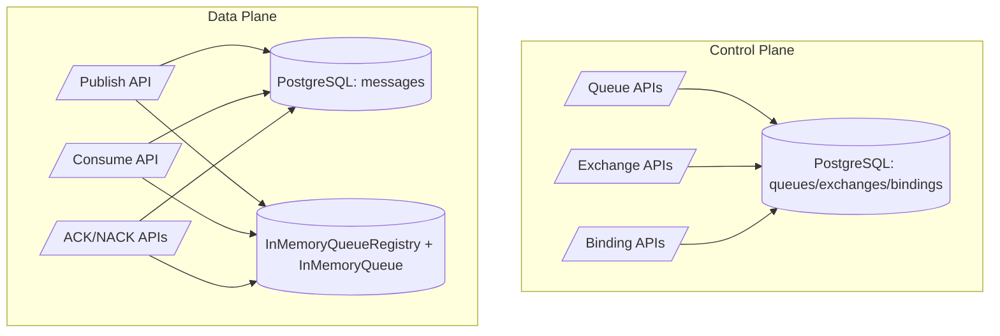
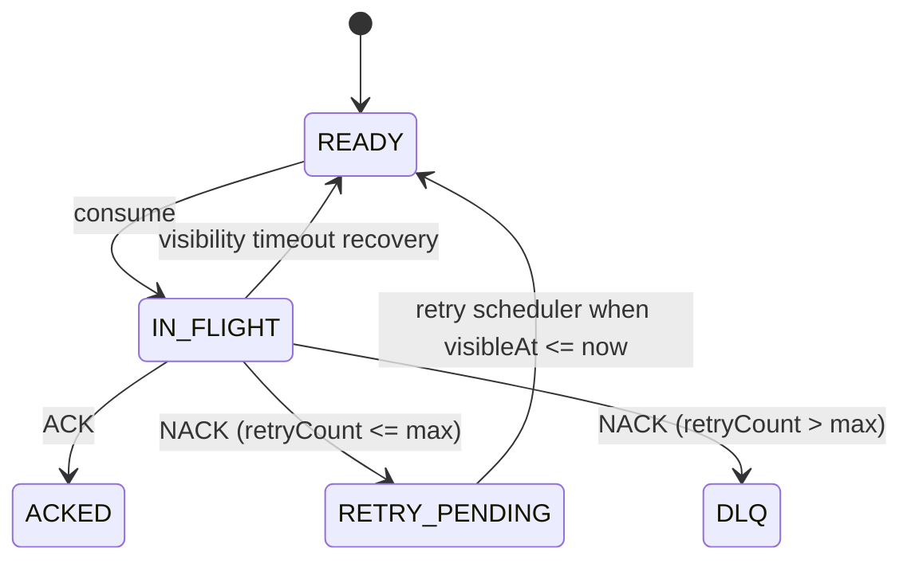

# PulseMQ

PulseMQ is a Spring Boot-based message broker that combines an in-memory runtime engine with PostgreSQL durability. It is built to provide low-latency message dispatch (`BlockingQueue` + `ConcurrentHashMap`) while preserving delivery state in a persistent store for restart recovery, retries, visibility timeout, and DLQ workflows.

---

## 1) Project Introduction

### What PulseMQ is

PulseMQ is a distributed-systems style broker runtime implemented in Java and Spring Boot with:

- Exchange -> Binding -> Queue routing primitives.
- Runtime in-memory queues for fast producer/consumer paths.
- PostgreSQL-backed message metadata and lifecycle state.
- Explicit ACK/NACK semantics.
- Retry orchestration and DLQ routing.
- Visibility timeout recovery for failed or crashed consumers.
- WAL-backed runtime recovery.

### Why it was built

PulseMQ is designed to explore production-grade broker internals rather than only a CRUD messaging API. The system intentionally separates hot-path runtime delivery from durable control/persistence concerns to model the architecture used in mature queueing systems.

### Conceptual inspiration

PulseMQ borrows ideas from:

- **RabbitMQ**: exchange-binding-key routing model.
- **Amazon SQS**: visibility timeout, explicit delete/ack behavior, DLQ thresholds.
- **Kafka-inspired durability thinking**: ordered append-only WAL events for crash replay and deterministic runtime restoration.

### Design goals

- Reliability under process restarts.
- Fault tolerance for consumer crashes/timeouts.
- Retry handling with backoff and bounded attempts.
- DLQ support as a first-class queue.
- Visibility timeout and in-flight recovery.
- In-memory runtime performance with persistent source-of-truth state.

---

## 2) Architecture Overview

### End-to-end routing chain


### Control plane vs data plane

- **Control plane**: queue/exchange/binding provisioning APIs and metadata persistence.
- **Data plane**: publish/consume/ack/nack runtime operations.



### Runtime + persistence layering

```text
+---------------------------------------------------------------+
|                      PulseMQ Broker Process                   |
|                                                               |
|  API Layer (REST Controllers)                                 |
|    - /api/exchanges /api/queues /api/bindings /api/messages   |
|                                                               |
|  Service Layer                                                 |
|    - MessagePublishService                                    |
|    - MessageConsumeService / MessageConsumeStateService       |
|    - MessageLifecycleService (ACK/NACK, retry, DLQ)          |
|    - VisibilityTimeoutService / RetryService schedulers       |
|                                                               |
|  Runtime Layer                                                 |
|    - InMemoryQueueRegistry: ConcurrentHashMap<UUID,Queue>     |
|    - InMemoryQueue: BlockingQueue ready buffer + inFlight map |
|                                                               |
|  Persistence Layer                                             |
|    - PostgreSQL tables: exchanges, queues, bindings, messages |
|    - WAL events (JSONL) for runtime-state replay              |
+---------------------------------------------------------------+
```

---

## 3) Core Concepts

### Exchanges

An exchange defines routing behavior:

- `DIRECT`: exact routing key match.
- `FANOUT`: broadcast to all bindings.
- `TOPIC`: wildcard routing (`*`, `#`) across dot-separated keys.

The implementation resolves matched bindings in `MessagePublishService`.

### Bindings

A binding is a tuple of `(exchange_id, queue_id, routing_key)` with uniqueness enforced at DB level (`bindings` unique constraint). Duplicate bindings are rejected.

### Routing keys

- Mandatory for `DIRECT` and `TOPIC` publish operations.
- Optional for `FANOUT`.
- Used at publish time to resolve target queue set.

### Queues

- `MAIN`: primary business queue.
- `DLQ`: dead-letter queue.
- `RETRY`: enum exists, while runtime retry flow currently uses `RETRY_PENDING` message status + scheduler rather than dedicated retry queue.

### DLQs as real queues (not special side-structure)

PulseMQ models DLQ as a normal `QueueEntity` + normal `InMemoryQueue`:

- Same scheduling/metrics/consume semantics as any queue.
- Uniform tooling/API model.
- No second code path for "special dead-letter storage".
- Enables replay through normal queue movement (`/api/v1/messages/{messageId}/replay`).

### Runtime queues

At runtime, each queue maps to:

- `BlockingQueue<QueuedMessage>`: READY backlog.
- `ConcurrentMap<UUID, QueuedMessage>`: IN_FLIGHT tracking.

### Message persistence

Every published message is inserted into `messages` with durable state fields (`status`, `retry_count`, `visible_at`, `original_queue_id`).

### Inflight tracking

Once consumed, message status is moved to `IN_FLIGHT`, tracked in memory with `inflightAt`, and must transition via ACK/NACK or timeout recovery.

---

## 4) Message Lifecycle

### Primary transitions



### ACK flow

- Consumer receives message from `/api/queues/{queueId}/consume`.
- Message moved to `IN_FLIGHT` in DB and in-memory in-flight map.
- `POST /api/messages/{queueId}/{messageId}/ack`:
  - removes from in-flight tracking,
  - persists `ACKED` status,
  - emits WAL ACK event,
  - increments ack/consumed metrics.

### NACK flow

`POST /api/messages/{queueId}/{messageId}/nack`:

- removes from in-flight tracking,
- increments `retryCount`,
- if within threshold (`MAX_RETRY_COUNT = 3`): sets `RETRY_PENDING` + future `visibleAt`,
- if exhausted: status -> `DLQ`, queue reference moved to queue's linked DLQ queue.

### Retry and backoff

Current delay ladder in `MessageLifecycleService`:

- Retry #1 -> 5s
- Retry #2 -> 30s
- Retry #3 -> 120s
- Beyond -> DLQ movement

### Visibility timeout recovery

`VisibilityTimeoutService` scans in-flight entries every 5s. If `inflightAt + 30s < now`, message is requeued as READY (without increasing retry count).

---

## 5) Reliability Guarantees

### Delivery semantics

PulseMQ provides **at-least-once delivery**:

- Messages may be delivered again after timeout recovery or crash/replay windows.
- Consumers must be idempotent (dedupe by message id in business storage).

### Duplicate possibilities

Duplicates are possible when:

- consumer processes but fails before ACK,
- timeout requeue races with external side effects,
- broker restarts and rehydrates READY/IN_FLIGHT runtime state.

### Why ACK is required

ACK is the commit point that allows broker-side safe terminalization (`ACKED`). Without ACK, message remains recoverable and is eligible for redelivery.

### Crash recovery behavior

- Durable state is persisted in PostgreSQL.
- Runtime transitions are captured to append-only WAL JSONL.
- On startup, `RecoveryService` replays WAL and then reconciles with DB state (`READY`, `IN_FLIGHT`, `DLQ`) to rebuild runtime queues.

### Visibility timeout behavior

Visibility timeout treats silent consumer failure as recoverable, not final failure. It returns messages to READY rather than counting as NACK.

---

## 6) Queue Runtime Engine

### Core structures

- `InMemoryQueueRegistry` holds `ConcurrentHashMap<UUID, InMemoryQueue>`.
- Each `InMemoryQueue` contains:
  - `BlockingQueue<QueuedMessage> buffer` for READY.
  - `ConcurrentMap<UUID, QueuedMessage> inFlightMessages` for processing claims.

### Runtime queue management

- Queues are bootstrapped from DB at startup (`QueueBootstrapService`).
- Created queues are registered immediately.
- Queue replacement preserves existing buffers/inflight maps where possible.

### Long polling consumers

Consume path uses `consumerWaitExecutor` (`cachedThreadPool`) and blocks on `buffer.take()` up to timeout, returning:

- `200` with message when available.
- `204 No Content` when timeout expires.

### Thread safety model

- Registry-level concurrency via `ConcurrentHashMap`.
- Queue-level critical sections use `synchronized` blocks for claim/restore/completion invariants.
- Prevents double-claim and inconsistent ready/inflight dual presence.

### Runtime vs persistence separation

- Runtime memory layer optimizes latency.
- PostgreSQL remains source of truth for lifecycle state.
- Runtime can be reconstructed from WAL + DB after restart.

---

## 7) Persistence Layer

PulseMQ uses JPA entities mapped to PostgreSQL.

### Why DB is not the runtime queue

Using PostgreSQL directly as dequeue primitive would increase lock contention, polling overhead, and latency for hot consumer loops. PulseMQ uses DB for durability and coordination, not as a high-frequency blocking queue.

### MessageEntity lifecycle fields

- `status`: READY, IN_FLIGHT, RETRY_PENDING, ACKED, DLQ, etc.
- `retryCount`: retry progression and DLQ thresholding.
- `visibleAt`: scheduler eligibility timestamp for retry requeue.
- `originalQueueId`: preserves source queue for DLQ replay.

### Table descriptions

#### `queues`

- `id` UUID PK
- `name` unique queue name
- `type` (`MAIN`, `DLQ`, `RETRY` enum)
- `dead_letter_queue_id` nullable FK to another queue
- `created_at`, `updated_at`

#### `exchanges`

- `id` UUID PK
- `name` unique exchange name
- `type` (`DIRECT`, `FANOUT`, `TOPIC`)
- `created_at`, `updated_at`

#### `bindings`

- `id` UUID PK
- `exchange_id` FK -> exchanges
- `queue_id` FK -> queues
- `routing_key`
- unique(exchange_id, queue_id, routing_key)
- `created_at`

#### `messages`

- `id` UUID PK
- `queue_id` FK -> queues
- `payload` text
- `status`
- `retry_count`
- `original_queue_id` nullable UUID
- `visible_at`
- `created_at`, `updated_at`
- indexes:
  - `(queue_id, status)`
  - `(visible_at)`

---

## 8) Retry and DLQ Flow

### Retry orchestration

1. Consumer NACKs message.
2. `MessageLifecycleService` increments `retryCount`.
3. Status -> `RETRY_PENDING`, `visibleAt` -> now + backoff delay.
4. `RetryPendingScheduler` (every 5s) finds eligible messages and requeues to runtime.
5. Status -> `READY`.

### Retry exhaustion

When `retryCount > 3`, message moves to associated DLQ queue and status becomes `DLQ`.

### Replay from DLQ

- List DLQ messages: `GET /api/v1/queues/{queueId}/dlq/messages`.
- Replay one message: `POST /api/v1/messages/{messageId}/replay`.

Replay resets:

- queue reference -> original queue,
- `retryCount` -> 0,
- status -> `READY`.

### Example timeline

```text
t0   READY (retry=0)
t1   consume -> IN_FLIGHT
t2   NACK -> RETRY_PENDING, visibleAt=t2+5s
t7   retry scheduler -> READY (retry=1)
t8   consume -> IN_FLIGHT
t9   NACK -> RETRY_PENDING, visibleAt=t9+30s
...
t40  consume -> IN_FLIGHT
t41  NACK (retry=4) -> DLQ
```

---

## 9) Visibility Timeout

### Why messages can get stuck

If a consumer crashes after delivery but before ACK/NACK, message remains logically in-flight forever unless broker reclaims it.

### Recovery mechanism

- In-flight messages carry `inflightAt` runtime timestamp.
- `VisibilityTimeoutScheduler` runs every 5s.
- If elapsed > 30s, broker:
  - removes from in-flight map,
  - re-enqueues message as READY,
  - updates DB status/visibility,
  - records WAL timeout event.

### Timeout recovery vs explicit NACK

- **Timeout recovery**: operational recovery path; no retry increment.
- **NACK**: explicit consumer-declared failure; increments retry and may lead to DLQ.

---

## 10) APIs

Base URL: `http://localhost:8080`

### Create Queue

- **Endpoint**: `POST /api/queues/createQueue`
- **Request body**:

```json
{
  "name": "orders.main",
  "type": "MAIN"
}
```

- **Sample response**:

```json
{
  "id": "6fe2e2f2-2d94-4579-aeb2-b038dbd9cbf4",
  "name": "orders.main",
  "type": "MAIN",
  "createdAt": "2026-05-12T10:00:00Z",
  "updatedAt": "2026-05-12T10:00:00Z"
}
```

- **Explanation**: creates queue metadata and runtime queue; for `MAIN`, PulseMQ auto-creates `<name>.dlq` and links it.

### Create Exchange

- **Endpoint**: `POST /api/exchanges/createExchange`
- **Request body**:

```json
{
  "name": "orders.exchange",
  "type": "DIRECT"
}
```

- **Sample response**:

```json
{
  "id": "b9bc2c75-5359-45f9-85dc-75ad70c3365f",
  "name": "orders.exchange",
  "type": "DIRECT",
  "createdAt": "2026-05-12T10:01:00Z",
  "updatedAt": "2026-05-12T10:01:00Z"
}
```

- **Explanation**: creates durable exchange definition used during publish routing.

### Create Binding

- **Endpoint**: `POST /api/bindings/createBinding`
- **Request body**:

```json
{
  "exchangeId": "b9bc2c75-5359-45f9-85dc-75ad70c3365f",
  "queueId": "6fe2e2f2-2d94-4579-aeb2-b038dbd9cbf4",
  "routingKey": "orders.created"
}
```

- **Sample response**:

```json
{
  "id": "c5be5e6b-2fa2-4f2e-9e8f-e4fa5ef08a79",
  "exchangeId": "b9bc2c75-5359-45f9-85dc-75ad70c3365f",
  "queueId": "6fe2e2f2-2d94-4579-aeb2-b038dbd9cbf4",
  "routingKey": "orders.created",
  "createdAt": "2026-05-12T10:02:00Z"
}
```

- **Explanation**: links exchange to queue for matching routing key.

### Publish Message

- **Endpoint**: `POST /api/messages/publish`
- **Request body**:

```json
{
  "exchangeId": "b9bc2c75-5359-45f9-85dc-75ad70c3365f",
  "payload": "{\"orderId\":\"ORD-1001\",\"amount\":1250}",
  "routingKey": "orders.created",
  "headers": {
    "traceId": "tr-001"
  }
}
```

- **Sample response**:

```json
{
  "exchangeId": "b9bc2c75-5359-45f9-85dc-75ad70c3365f",
  "exchangeName": "orders.exchange",
  "exchangeType": "DIRECT",
  "routingKey": "orders.created",
  "matchedQueues": 1,
  "savedMessages": 1,
  "publishedAt": "2026-05-12T10:03:00Z",
  "deliveries": [
    {
      "queueId": "6fe2e2f2-2d94-4579-aeb2-b038dbd9cbf4",
      "queueName": "orders.main",
      "messageId": "8c99f20f-7403-41b6-bf9b-bacf832fbc19",
      "status": "READY",
      "visibleAt": "2026-05-12T10:03:00Z"
    }
  ]
}
```

- **Explanation**: persists messages first, then enqueues them into runtime queue(s), and writes WAL publish event.

### Consume Message (long polling)

- **Endpoint**: `GET /api/queues/{queueId}/consume?timeout=30`
- **Sample response (200)**:

```json
{
  "id": "8c99f20f-7403-41b6-bf9b-bacf832fbc19",
  "queueId": "6fe2e2f2-2d94-4579-aeb2-b038dbd9cbf4",
  "payload": "{\"orderId\":\"ORD-1001\",\"amount\":1250}",
  "status": "IN_FLIGHT",
  "retryCount": 0,
  "visibleAt": "2026-05-12T10:03:10Z",
  "createdAt": "2026-05-12T10:03:00Z",
  "updatedAt": "2026-05-12T10:03:10Z"
}
```

- **Sample response (timeout)**: `204 No Content`
- **Explanation**: blocks until message available or timeout; successful consume marks message `IN_FLIGHT`.

### ACK

- **Endpoint**: `POST /api/messages/{queueId}/{messageId}/ack`
- **Sample response**:

```json
{
  "queueId": "6fe2e2f2-2d94-4579-aeb2-b038dbd9cbf4",
  "queueName": "orders.main",
  "messageId": "8c99f20f-7403-41b6-bf9b-bacf832fbc19",
  "action": "ACK",
  "status": "ACKED",
  "retryCount": 0,
  "deadLettered": false,
  "readyQueueSize": 0,
  "deadLetterQueueSize": 0,
  "processedAt": "2026-05-12T10:03:12Z"
}
```

- **Explanation**: finalizes delivery and removes message from runtime in-flight set.

### NACK

- **Endpoint**: `POST /api/messages/{queueId}/{messageId}/nack`
- **Sample response (retry pending)**:

```json
{
  "queueId": "6fe2e2f2-2d94-4579-aeb2-b038dbd9cbf4",
  "queueName": "orders.main",
  "messageId": "8c99f20f-7403-41b6-bf9b-bacf832fbc19",
  "action": "NACK",
  "status": "RETRY_PENDING",
  "retryCount": 1,
  "deadLettered": false,
  "readyQueueSize": 0,
  "deadLetterQueueSize": 0,
  "processedAt": "2026-05-12T10:03:15Z"
}
```

- **Explanation**: schedules delayed retry or DLQ movement when retry budget is exhausted.

### DLQ list

- **Endpoint**: `GET /api/v1/queues/{queueId}/dlq/messages`
- **Sample response**:

```json
[
  {
    "id": "d9af6fc2-f757-4eb5-a4ad-58dc6ee69589",
    "queueId": "f6cc70aa-fbfa-41f4-8ef0-0fcf5c027c0f",
    "payload": "{\"orderId\":\"ORD-1001\"}",
    "status": "DLQ",
    "retryCount": 4,
    "visibleAt": "2026-05-12T10:06:00Z",
    "createdAt": "2026-05-12T10:03:00Z",
    "updatedAt": "2026-05-12T10:06:00Z"
  }
]
```

- **Explanation**: fetches all DLQ-status messages currently assigned to this queue's linked DLQ.

### DLQ Replay

- **Endpoint**: `POST /api/v1/messages/{messageId}/replay`
- **Sample response**:

```json
{
  "queueId": "6fe2e2f2-2d94-4579-aeb2-b038dbd9cbf4",
  "queueName": "orders.main",
  "messageId": "d9af6fc2-f757-4eb5-a4ad-58dc6ee69589",
  "action": "REPLAY",
  "status": "READY",
  "retryCount": 0,
  "deadLettered": false,
  "readyQueueSize": 1,
  "deadLetterQueueSize": 0,
  "processedAt": "2026-05-12T10:08:00Z"
}
```

- **Explanation**: moves DLQ message back to original queue and re-enqueues it for consumption.

---

## 11) Internal Components

The architecture uses explicit separation of concerns to reduce coupling and race-prone state transitions.

| Conceptual role | Current implementation | Responsibility |
|---|---|---|
| QueueManager | `InMemoryQueueRegistry` + `InMemoryQueue` | Runtime queue registration, lookup, READY/in-flight structures |
| RoutingService | `MessagePublishService` | Exchange type evaluation, binding match, fanout/direct/topic routing |
| MessageLifecycleService | `MessageLifecycleService` | ACK/NACK transitions, retry scheduling, DLQ movement |
| VisibilityTimeoutScheduler | `VisibilityTimeoutScheduler` + `VisibilityTimeoutService` | In-flight timeout scanning and auto-requeue |
| RetryService | `RetryPendingScheduler` + `RetryService` | Process `RETRY_PENDING` messages when visible |
| InMemoryQueueRegistry | `InMemoryQueueRegistry` | Global concurrent runtime queue registry |

Separation is intentional: publish, consume-state finalization, lifecycle decisions, timeout recovery, and retry execution are isolated so each path can be reasoned about and tested independently.

---

## 12) Concurrency Model

### Thread safety primitives

- `ConcurrentHashMap` for registry and in-flight maps.
- `LinkedBlockingQueue` for producer/consumer handoff.
- `synchronized` sections in `InMemoryQueue` for atomic transitions.

### Race condition prevention strategy

PulseMQ avoids split-brain runtime state by ensuring each transition atomically removes/adds message identity across READY and IN_FLIGHT containers.

### Concurrent producers and consumers

- Multiple producers can enqueue simultaneously.
- Multiple consumers can long-poll and consume from same queue.
- Claiming logic checks in-flight first, then removes from READY under lock to prevent duplicate claims.

### Transaction-aware rollback safety

`MessageConsumeStateService` registers transaction synchronization and restores READY message if DB transaction does not commit.

---

## 13) Future Improvements

- WAL checkpointing + compaction + stronger replay determinism.
- Multi-node clustering mode.
- Leader/follower replication and failover.
- Native Netty TCP protocol in addition to HTTP.
- Richer topic exchange semantics and routing optimizations.
- Partitioned queues for parallelism and ordering domains.
- Expanded Grafana dashboards and SLO alerting.
- Bulk replay tooling for DLQ and archived traffic.
- Distributed coordination for shard ownership and scheduler leadership.

---

## 14) Local Development Setup

### Prerequisites

- Java 17+
- Maven 3.9+ (or use wrapper)
- PostgreSQL 14+

### PostgreSQL setup

```sql
CREATE DATABASE pulsemq;
```

### Environment variables

PulseMQ uses these variables (defaults shown from `application.properties`):

- `DB_URL` (default: `jdbc:postgresql://localhost:5432/pulsemq`)
- `DB_USERNAME` (default: `postgres`)
- `DB_PASSWORD` (default: `1234`)

### Build and run (PowerShell)

```powershell
Set-Location "C:\Users\manan\OneDrive\Desktop\PulseMQ"
.\mvnw.cmd clean test
.\mvnw.cmd spring-boot:run
```

### Verify broker endpoints

- Health: `http://localhost:8080/actuator/health`
- Prometheus scrape: `http://localhost:8080/actuator/prometheus`
- Swagger UI (springdoc): `http://localhost:8080/swagger-ui/index.html`

---

## 15) Example End-to-End Flow

Assume service running on `localhost:8080`.

### 1. Create exchange

```bash
curl -X POST http://localhost:8080/api/exchanges/createExchange \
  -H "Content-Type: application/json" \
  -d '{"name":"orders.exchange","type":"DIRECT"}'
```

### 2. Create queue (DLQ auto-created)

```bash
curl -X POST http://localhost:8080/api/queues/createQueue \
  -H "Content-Type: application/json" \
  -d '{"name":"orders.main","type":"MAIN"}'
```

### 3. Bind queue

```bash
curl -X POST http://localhost:8080/api/bindings/createBinding \
  -H "Content-Type: application/json" \
  -d '{"exchangeId":"<exchange-id>","queueId":"<queue-id>","routingKey":"orders.created"}'
```

### 4. Publish message

```bash
curl -X POST http://localhost:8080/api/messages/publish \
  -H "Content-Type: application/json" \
  -d '{
    "exchangeId":"<exchange-id>",
    "routingKey":"orders.created",
    "payload":"{\"orderId\":\"ORD-1001\",\"amount\":1250}",
    "headers":{"source":"checkout-service"}
  }'
```

### 5. Consume message (long-poll)

```bash
curl "http://localhost:8080/api/queues/<queue-id>/consume?timeout=30"
```

### 6a. ACK success path

```bash
curl -X POST http://localhost:8080/api/messages/<queue-id>/<message-id>/ack
```

### 6b. NACK retry path

```bash
curl -X POST http://localhost:8080/api/messages/<queue-id>/<message-id>/nack
```

### 7. Observe retries then DLQ

After repeated NACKs beyond retry threshold:

```bash
curl http://localhost:8080/api/v1/queues/<queue-id>/dlq/messages
```

### 8. Replay from DLQ

```bash
curl -X POST http://localhost:8080/api/v1/messages/<dlq-message-id>/replay
```

---

## 16) Design Decisions

### Why PostgreSQL

- Strong transactional semantics for message lifecycle state.
- Mature indexing/query model for scheduler scans (`visibleAt`, status filters).
- Operational familiarity and ecosystem support.

### Why in-memory runtime queues

- Low-latency dequeue without DB round-trip for every poll.
- Natural fit for blocking long-poll consumption.
- Better separation between durability and dispatch performance concerns.

### Why DLQ is modeled as queue

- Keeps broker semantics uniform.
- Allows direct metrics, visibility, replay, and future consumers on DLQ.
- Simplifies implementation and avoids one-off dead-letter code paths.

### Why `BlockingQueue`

- Efficient producer-consumer handoff.
- Supports blocking take for long polling semantics.
- Reduces spin/poll loops and CPU waste.

### Why UUID identifiers

- Collision-safe distributed identity without central sequence coordination.
- Suitable for future sharded/distributed broker expansion.

### Why visibility timeout exists

- Handles crash-before-ack failures.
- Prevents permanent message loss in abandoned in-flight state.
- Maintains at-least-once semantics.

---

## 17) Monitoring and Observability

PulseMQ exposes Micrometer metrics and Prometheus endpoint via Spring Boot Actuator.

### Endpoints

- `GET /actuator/prometheus`
- `GET /actuator/metrics`

### Queue metrics

- `pulsemq_queue_depth{queueId,queueName}` (gauge)
- `pulsemq_inflight_count{queueId,queueName}` (gauge)
- `pulsemq_messages_published{queueId,queueName}` (counter)
- `pulsemq_messages_consumed{queueId,queueName}` (counter)
- `pulsemq_ack_total{queueId,queueName}` (counter)
- `pulsemq_nack_total{queueId,queueName}` (counter)
- `pulsemq_retry_total{queueId,queueName}` (counter)
- `pulsemq_dlq_total{queueId,queueName}` (counter)

### Operational notes

- Queue depth changes are logged by `QueueMetricsService`.
- DLQ growth warning threshold currently logs warning when depth > 50.
- Sample Prometheus and Grafana assets are in `docs/prometheus.yml` and `docs/grafana-dashboard-pulsemq.json`.

---

## 18) Testing

PulseMQ includes comprehensive unit, service-layer, and controller-level tests covering lifecycle integrity, routing, retry/visibility recovery, purge behavior, and full API flows.

### Test Structure

```
src/test/java/org/pulsemq/pulsemq/
├── broker/publish/
│   └── MessagePublishServiceTest.java        # Routing (DIRECT, TOPIC), binding matching
├── psql/service/
│   └── MessageLifecycleServiceTest.java      # ACK/NACK transitions, DLQ movement, retry backoff
├── service/
│   ├── MessageConsumeServiceTest.java        # Long-poll consume, timeout behavior
│   └── RetryAndVisibilityServiceTest.java    # Retry requeue, visibility timeout recovery
├── service/impl/
│   └── QueueServiceImplTest.java             # Purge READY/IN_FLIGHT/RETRY_PENDING states
└── controller/
    └── BrokerControllerFlowWebMvcTest.java   # Full API flow: create → bind → publish → consume → ack
```

### Test Coverage Summary

| Category | Test Class | Key Scenarios |
|----------|-----------|---|
| **Routing** | `MessagePublishServiceTest` | DIRECT exact match; TOPIC wildcard (`*`, `#`); no-binding failure |
| **Lifecycle** | `MessageLifecycleServiceTest` | ACK only on IN_FLIGHT; NACK → RETRY_PENDING with backoff; exhaustion → DLQ |
| **Consume** | `MessageConsumeServiceTest` | Long-poll success; timeout returns empty |
| **Recovery** | `RetryAndVisibilityServiceTest` | Retry scheduler requeue; visibility timeout auto-requeue |
| **Purge** | `QueueServiceImplTest` | Clears READY, IN_FLIGHT, RETRY_PENDING from DB and runtime |
| **Controller** | `BrokerControllerFlowWebMvcTest` | Full multi-endpoint flow; edge cases (204, 409 status codes) |

### Running Tests

**Run all tests:**

```powershell
Set-Location "C:\Users\manan\OneDrive\Desktop\PulseMQ"
.\mvnw.cmd test
```

**Run a specific test class:**

```powershell
.\mvnw.cmd test -Dtest=MessageLifecycleServiceTest
```

**Run tests with detailed output:**

```powershell
.\mvnw.cmd test -X
```

### Key Test Scenarios

#### Lifecycle Integrity (`MessageLifecycleServiceTest`)

- **ACK must reject non-IN_FLIGHT**: messages in `READY` or other states are rejected.
- **NACK with backoff**: delays follow 5s → 30s → 120s progression before DLQ at retry count > 3.
- **DLQ movement**: message moved to queue's linked DLQ with `originalQueueId` preserved for replay.

#### Routing Correctness (`MessagePublishServiceTest`)

- **DIRECT**: only bindings with exact routing key match.
- **TOPIC**: wildcard patterns (`orders.*` matches `orders.created`; `#` matches all).
- **Failure path**: publish fails and throws `IllegalArgumentException` when no bindings match.

#### Recovery Paths

- **Retry scheduler** (`RetryAndVisibilityServiceTest`): finds `RETRY_PENDING` messages where `visibleAt <= now` and re-enqueues to `READY`.
- **Visibility timeout**: messages in-flight for > 30s are auto-requeued without incrementing retry count.

#### Purge Atomicity (`QueueServiceImplTest`)

- Purge updates DB state to `PURGED` for `READY`, `IN_FLIGHT`, and `RETRY_PENDING`.
- Runtime queues are cleared for both ready buffer and in-flight map simultaneously.

#### Controller Flow (`BrokerControllerFlowWebMvcTest`)

```
POST /api/queues/createQueue              → CreateQueueResponseDTO (200)
POST /api/exchanges/createExchange        → CreateExchangeResponseDTO (200)
POST /api/bindings/createBinding          → CreateBindingResponseDTO (200)
POST /api/messages/publish                → PublishMessageResponseDTO (200)
GET  /api/queues/{queueId}/consume        → QueueMessageResponseDTO (200) or 204 No Content
POST /api/messages/{queueId}/{messageId}/ack → MessageLifecycleResponseDTO (200)
POST /api/messages/{queueId}/{messageId}/nack → MessageLifecycleResponseDTO (200) or 409 Conflict
```

### Test Execution Output

Latest test summary:
- **Total tests:** 11
- **Passed:** 11
- **Failed:** 0
- **Execution time:** ~7s

Sample log output from tests:
```
MessageLifecycleServiceTest
  ✓ ackMessageMarksInFlightMessageAsAcked
  ✓ ackMessageRejectsNonInflightMessage
  ✓ nackMessageSchedulesRetryPendingWithBackoff
  ✓ nackMessageMovesToDlqAfterRetryExhausted

MessagePublishServiceTest
  ✓ publishMessageRoutesOnlyMatchedDirectBindings
  ✓ publishMessageSupportsTopicWildcardRouting
  ✓ publishMessageFailsWhenNoBindingMatches

MessageConsumeServiceTest
  ✓ consumeMessageReturnsMessageWhenAvailable
  ✓ consumeMessageReturnsEmptyOnTimeout

RetryAndVisibilityServiceTest
  ✓ retryServiceRequeuesEligiblePendingMessages
  ✓ visibilityTimeoutServiceRequeuesTimedOutInflightMessages

QueueServiceImplTest
  ✓ purgeQueueClearsReadyInflightAndRetryPendingStates

BrokerControllerFlowWebMvcTest
  ✓ createBindPublishConsumeAckFlowReturnsExpectedResponses
  ✓ consumeEndpointReturnsNoContentOnTimeout
  ✓ nackEndpointReturnsConflictWhenMessageIsNotInflight
```

### Mocking Strategy

- **Unit tests** use Mockito `@Mock` + `@MockBean` for repository/service isolation.
- **Controller tests** use standalone `MockMvc` + `@Mock` to avoid Spring test framework dependencies.
- **Lenient stubs** are used where shared setup mocks may not be called by all test methods.

### Test Quality Standards

- All tests validate postconditions (assertions on state changes, response status codes).
- Edge cases are tested (empty results, timeout paths, conflict states).
- Failure paths include both happy-path and exception-throwing scenarios.
- Runtime and persistence layer consistency is verified (DB and in-memory state alignment).

---

## Additional Notes

- WAL paths and sizes are configurable via `pulsemq.wal.*` properties.
- Schedulers (`RetryPendingScheduler`, `VisibilityTimeoutScheduler`) execute only after broker recovery state is marked recovered.
- This repository currently runs as a single broker node process; distributed deployment features are listed in future improvements.

